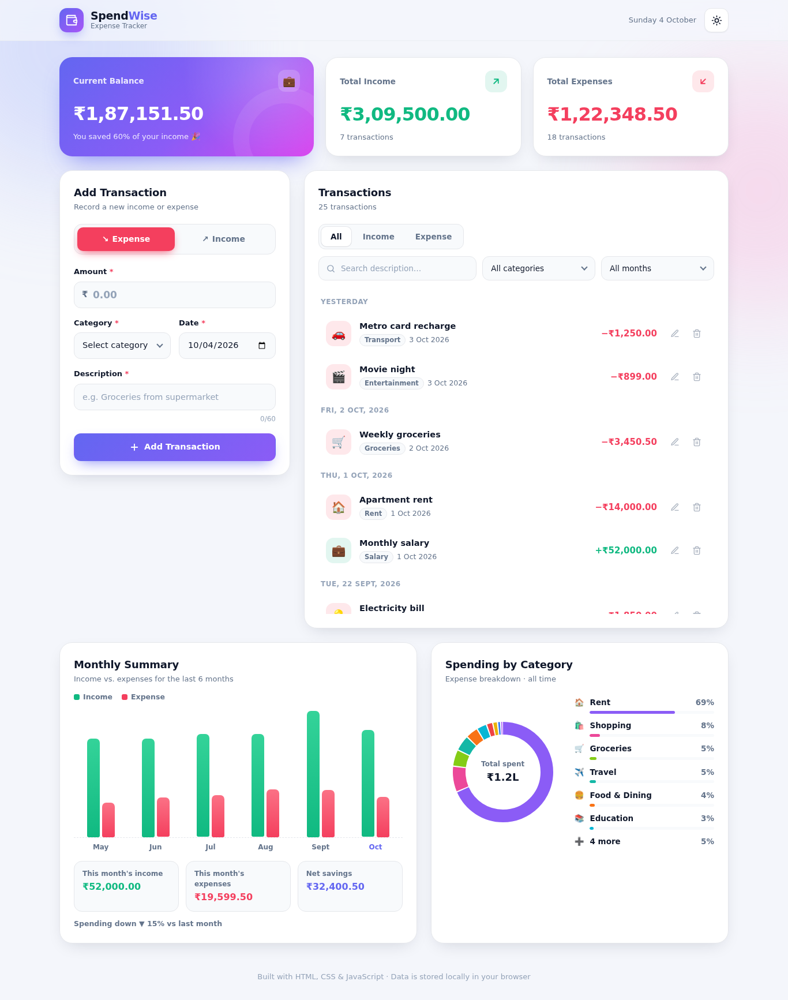

# SpendWise — Expense Tracker (MERN)

A full-stack expense tracker built with **MongoDB, Express, React and Node**. Transactions are stored in MongoDB through a REST API, and the React front end is organised so that all business rules live in one shared, unit-tested layer used by both sides.

> **Built with AI assistance.** See [docs/AI-DISCLOSURE.md](docs/AI-DISCLOSURE.md).



---

## Quick Start

You need **Node.js 18+** and **MongoDB** (either a local `mongod` or a free MongoDB Atlas cluster).

```bash
# 1. Clone
git clone https://github.com/Rejinrajeev/expense---tracker-candidate-Rejin.git
cd expense---tracker-candidate-Rejin

# 2. Install both halves
npm run install:all

# 3. Configure the database
cp server/.env.example server/.env
#    The default points at mongodb://127.0.0.1:27017/spendwise
#    For Atlas, paste your connection string into server/.env instead.
```

Then start the two processes **in separate terminals**:

```bash
# Terminal 1 — the API on port 5000
npm run dev:server

# Terminal 2 — the React app on port 5173
npm run dev:client
```

Open **<http://localhost:5173>**.

The Vite dev server proxies `/api` to port 5000, so there is no CORS setup and no URL to configure in the front end.

### No MongoDB installed?

Use MongoDB Atlas — it is free and needs no local install:

1. Create a cluster at <https://www.mongodb.com/cloud/atlas/register>
2. **Database Access** → add a user; **Network Access** → allow your IP
3. **Connect** → *Drivers* → copy the connection string
4. Paste it into `server/.env` as `MONGODB_URI`, replacing `<password>` and keeping `/spendwise` as the database name

The server prints clear instructions and exits if it cannot connect, so you will not be left guessing.

---

## Running the Tests

```bash
npm test
```

Node's built-in test runner, **no dependencies and no database required** — the tests cover `shared/`, the domain layer that both the server and the client import.

| File | Covers |
| --- | --- |
| `tests/validation.test.js` | Every field rule, plus duplicate detection |
| `tests/transaction-store.test.js` | Filtering, sorting, totals, filter reconciliation |
| `tests/budget-model.test.js` | Spend totals, thresholds, snapshots, alerts |
| `tests/insights-model.test.js` | Month windows, bar scaling, category shares |
| `tests/serializer.test.js` | CSV quoting, formula injection, backup round trip |
| `tests/storage.test.js` | The backup import plan (`planImport`) |
| `tests/utils.test.js` | Currency, dates, rounding, escaping |

---

## Features

### Core
- **Add transactions** — income or expense, with amount, category, date and description
- **Edit and delete**, with a confirmation dialog and an **Undo** button after deleting
- **Summary cards** for total income, total expenses and current balance, with your savings rate
- **Filters** by type, category and month, plus a text search, all combinable
- **Sorting** by newest, oldest, highest or lowest amount
- **Persisted in MongoDB** through the REST API
- **Responsive** across desktop, tablet and mobile

### Bonus
- **Monthly summary** — a 6-month income vs. expense bar chart, with this month's totals, net savings and the change in spending since last month
- **Category chart** — a donut chart of expenses by category that follows the month filter
- **Validation with helpful messages** on every field, enforced **twice**: once in the React form for instant feedback, and again in Express before anything reaches MongoDB, using the same functions

### Extra
- 🎯 **Monthly budget** — a spending limit with a progress bar that turns amber at 80% and red when exceeded, showing what is left, days remaining and a suggested daily allowance
- 📤 **Export and import** — CSV of the visible rows, full JSON backup, restore from a backup, and clear-all
- 🔁 **Duplicate detection** — submitting an identical transaction warns first and goes through on a second submit
- 🌙 Light and dark theme, remembered per browser
- ⌨️ Keyboard support — `Esc` closes dialogs and cancels editing
- ♿ Accessible labels, focus styles and `prefers-reduced-motion` support

---

## Project Structure

```
├── shared/                      Domain layer — imported by BOTH sides
│   ├── validation.js            Field rules and their messages
│   ├── insights.js              Chart aggregation and budget maths
│   ├── filters.js               Filtering and sorting
│   ├── merge.js                 Backup import planning
│   ├── serializer.js            CSV / JSON in and out
│   ├── categories.js            Category catalogue
│   └── utils.js                 Currency, dates, rounding
│
├── server/                      Express + MongoDB API
│   └── src/
│       ├── server.js            Entry point
│       ├── config/db.js         Mongoose connection
│       ├── models/              Mongoose schemas
│       │   ├── transaction.model.js
│       │   └── budget.model.js
│       ├── controllers/         Request handling
│       │   ├── transaction.controller.js
│       │   └── budget.controller.js
│       ├── routes/index.js      The API surface
│       └── middleware/
│           └── error-handler.js
│
├── client/                      React (Vite)
│   └── src/
│       ├── main.jsx             Entry point
│       ├── App.jsx              Layout and view state
│       ├── api/client.js        The only place that calls fetch
│       ├── hooks/
│       │   ├── useTransactions.js   Data and all API writes
│       │   ├── useToasts.js
│       │   └── useTheme.js
│       ├── components/          SummaryCards, BudgetCard, TransactionForm,
│       │                        TransactionList, Filters, Insights,
│       │                        DataMenu, ConfirmModal, Toasts, AppHeader
│       ├── lib/download.js      Blob downloads and FileReader
│       └── styles/app.css
│
├── tests/                       Unit tests for shared/ (node --test)
└── docs/
    ├── ARCHITECTURE.md          How the layers fit together
    ├── AI-DISCLOSURE.md         How this project was built
    └── screenshots/
```

[docs/ARCHITECTURE.md](docs/ARCHITECTURE.md) explains the layering and walks a
request from a React click through Express into MongoDB and back.

---

## API

| Method | Path | Purpose |
| --- | --- | --- |
| `GET` | `/api/transactions` | All transactions, newest first, with totals |
| `POST` | `/api/transactions` | Create one |
| `PUT` | `/api/transactions/:id` | Update one |
| `DELETE` | `/api/transactions/:id` | Delete one (returns it, so Undo works) |
| `POST` | `/api/transactions/restore` | Re-create one after an Undo |
| `POST` | `/api/transactions/import` | Merge a backup, skipping duplicates |
| `DELETE` | `/api/transactions` | Clear everything |
| `GET` | `/api/budget` | The current monthly limit |
| `PUT` | `/api/budget` | Set the limit |
| `DELETE` | `/api/budget` | Remove the limit |
| `GET` | `/api/categories` | The category catalogue |
| `GET` | `/api/health` | Liveness check |

A rejected write returns `400` with per-field messages, which the React form
displays inline:

```json
{
  "message": "Please fix the highlighted fields.",
  "errors": { "amount": "Amount must be greater than zero." }
}
```

---

## Tech

**MongoDB** · **Express 4** · **React 18** · **Node 18+** · Mongoose · Vite · inline SVG charts · `node --test`

No charting library, no UI framework, no state-management library.
