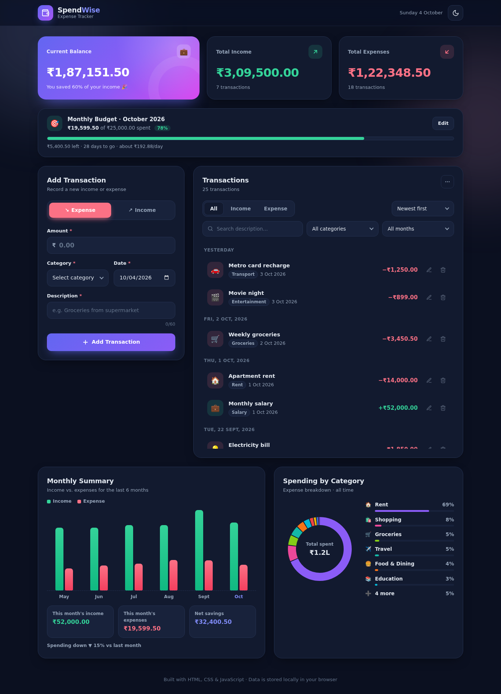
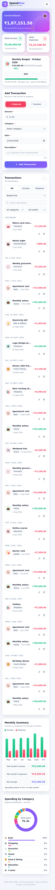

# SpendWise — Expense Tracker

A clean, responsive expense tracker web app built with plain **HTML, CSS and JavaScript**. You don't need any frameworks, build tools or installs.


## Features

### Core
- **Add transactions**: income or expense, with amount, category, date and description
- **Edit and delete** transactions (deleting asks you to confirm first)
- **Summary cards** for total income, total expenses and current balance, with your savings rate
- **Filters** by type (All / Income / Expense), category and month, plus a text search
- **Saved in Local Storage**: your data is still there after you refresh the page
- **Responsive design** that works on desktop, tablet and mobile

### Bonus
- **Monthly summary**: a 6-month income vs. expense bar chart, plus this month's income, expenses, net savings and the change in spending since last month
- **Category-wise chart**: a donut chart of expenses by category. It follows the month filter.
- **Validation with helpful messages**: each field gets its own error message, checked when you submit and when you leave the field
  - Amount is required, must be greater than 0, can be at most ₹1 crore and can have at most 2 decimal places
  - Category must match the selected type
  - Date is required and can't be in the future
  - Description must be 3–60 characters
  - You get a warning when an expense is larger than your available balance
  - **Duplicate detection**: you get a warning when an identical transaction already exists, and you submit again to confirm
  - **Live re-checking**: once a field shows an error, it is re-checked as you type
  - **Amount preview**: the amount is shown in currency format as you type (e.g. ₹1,25,000.00), with a reminder to double-check amounts over ₹1 lakh
  - **Budget validation**: the budget must be a positive number of at most ₹1 crore
  - **Import validation**: the file type and size are checked, every imported transaction is validated with the same rules as the form, and invalid or duplicate entries are skipped and counted

### Extra features
- 🎯 **Monthly budget**: set a spending limit for the month. The progress bar turns amber at 80% and red when you go over. It also shows how much is left, the days remaining and a suggested daily limit, and you get an alert when a new expense crosses 80% or 100%.
- 📤 **Export and import**:
  - Export the visible transactions as **CSV**, which opens in Excel or Google Sheets
  - Download a full **JSON backup**, and **restore** from one later
  - Clear all data, after a confirmation
- ↩️ **Undo delete**: the notification shown after a delete has an *Undo* button
- ↕️ **Sorting**: newest first, oldest first, highest amount or lowest amount
- 🌙 Light and dark theme (your choice is remembered)
- Transactions grouped by day ("Today", "Yesterday", …)
- Toast notifications, smooth animations and keyboard support (`Esc` closes dialogs and cancels editing)
- Accessible labels, focus styles and `prefers-reduced-motion` support

## How to Run

**Option 1: open the file directly**

1. Clone or download this repository
   ```bash
   git clone https://github.com/Rejinrajeev/expense---tracker-candidate-Rejin.git
   cd expense---tracker-candidate-Rejin
   ```
2. Open `index.html` in any modern browser (Chrome, Edge, Firefox or Safari).

**Option 2: run a local server (optional)**

```bash
# Python 3
python -m http.server 8000
# or Node.js
npx serve .
```
Then go to <http://localhost:8000>.

## Project Structure

```
├── index.html          # Page markup
├── css/
│   └── style.css       # Styles, theme tokens, responsive layout
├── js/
│   ├── utils.js        # Formatting helpers & category definitions
│   ├── storage.js      # Local Storage read/write
│   ├── validation.js   # Form validation rules & messages
│   ├── charts.js       # Monthly bar chart & category donut (SVG)
│   ├── budget.js       # Monthly budget tracking & alerts
│   ├── data-io.js      # CSV/JSON export, validated backup import
│   └── app.js          # App state, rendering, events
├── assets/favicon.svg
└── docs/screenshots/
```

## Screenshots

| Dark mode | Mobile |
|-----------|--------|
|  |  |

## Development Workflow

Each feature was built on its own branch and merged into the main development branch with `--no-ff`, so the history shows each step:

| Branch | What it adds |
|--------|--------------|
| `feature/ui-layout` | Page structure and responsive theme |
| `feature/transactions` | Add / edit / delete, totals, Local Storage |
| `feature/filters` | Filter by type, category, month and search |
| `feature/validation` | Form validation and error messages |
| `feature/insights-charts` | Monthly summary and category chart |
| `fix/mobile-layout` | Small-screen layout fixes |
| `docs/readme` | Documentation and screenshots |
| `feature/sorting` | Sort by date or amount |
| `feature/undo-delete` | Undo after deleting |
| `feature/smart-validation` | Duplicate detection, live re-checking, amount preview |
| `feature/monthly-budget` | Monthly budget with alerts |
| `feature/export-import` | CSV export, JSON backup and restore, clear all |
| `docs/new-features` | README update for the new features |

Commit messages follow the [Conventional Commits](https://www.conventionalcommits.org/) style (`feat:`, `fix:`, `style:`, `docs:`).

## Tech

HTML5 · CSS3 (Grid, Flexbox, custom properties) · Vanilla JavaScript (ES6+) · Local Storage API · inline SVG charts
